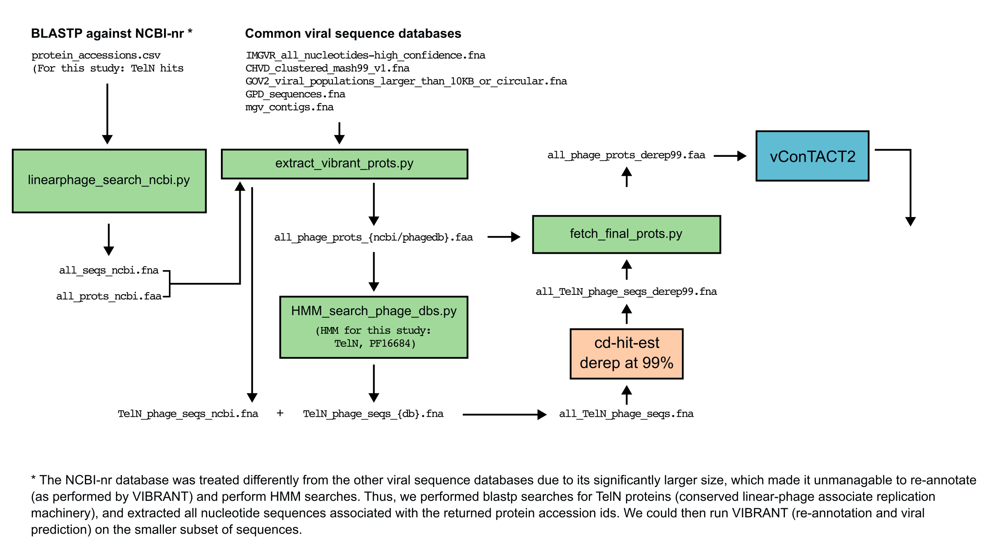

# Santoriello & Bassler (2025) - A family of linear plasmid phages that detect a quorum-sensing autoinducer exists in multiple bacterial species. mBio. doi: 10.1128/mbio.02320-25

A collection of scripts that make up the pipeline used in our 2025 mBio paper on quorum-sensing linear plasmid phages.

The scripts are designed to be chained as shown below but can also be run independently and modified to the needs of the user.




## Requirements

- Python ≥ 3.8
- [Biopython](https://biopython.org/) (`SeqIO`, `SearchIO`, `Entrez`)
- An NCBI account (email address, optionally an API key) — required by `linearphage_search_ncbi.py`
- [VIBRANT](https://github.com/AnantharamanLab/VIBRANT) — required by `extract_vibrant_prots.py`
- [HMMER](http://hmmer.org/) (`hmmsearch` on `$PATH`) — required by `HMM_search_phage_dbs.py`
- [CD-HIT](https://github.com/weizhongli/cdhit/) - used as a standalone program (see diagram)
- [vConTACT2](https://github.com/Hocnonsense/vcontact2) - used as a standalone program (see diagram)

Install Python deps:

```bash
pip install biopython
```

## Scripts

### 1. `linearphage_search_ncbi.py`

Given a CSV of protein accessions, retrieves every unique identical-protein-group (IPG)
entry from NCBI, fetches the associated GenBank records in chunks, and writes a combined
nucleotide FASTA plus a combined protein FASTA of every CDS in those records.

**Usage:**

```bash
python linearphage_search_ncbi.py [options] <prot_id_csv_file> <email>
```

**Required arguments:**

| Argument | Description |
| --- | --- |
| `prot_id_csv_file` | CSV of NCBI protein accessions. One per line or a single comma-separated row. |
| `email` | Email address for NCBI Entrez (required by their terms of use). |

**Options:**

| Flag | Default | Description |
| --- | --- | --- |
| `-l`, `--len` | `15000` | Minimum nucleotide length filter for GenBank records. |
| `-o`, `--outdir` | cwd | Output directory (created if missing). |
| `--api` | — | NCBI API key for a higher request-rate limit. |
| `-v`, `--verbose` | off | Print raw IPG records as they are fetched. |

**Outputs** (written to `--outdir`):

- `all_seqs.fna` — combined nucleotide FASTA
- `all_prots.faa` — combined protein FASTA (one record per CDS)

**Notes:**

- INSDC rows are preferred; RefSeq rows are kept only when they aren't duplicates of an
  INSDC record (matched on assembly accession).
- IPG fetches are throttled to stay under NCBI's rate limit. Chunk fetches use a 3-attempt
  retry with 2s backoff for transient failures.

---

### 2. `extract_vibrant_prots.py`

Runs VIBRANT on an input nucleotide FASTA, then either:

- (**`--ncbi`**) filters a companion protein FASTA (as produced by
  `linearphage_search_ncbi.py`) down to proteins whose parent contig survived VIBRANT, or
- (**`--phagedb …`**) reformats VIBRANT's own protein FASTA headers into an NCBI-style
  layout, using a per-database delimiter to recover the contig accession.

**Usage:**

```bash
# NCBI companion path
python extract_vibrant_prots.py --ncbi --prot_fasta all_prots.faa \
    -p /path/to/VIBRANT -d /path/to/VIBRANT/databases \
    all_seqs.fna

# Public phage-db reformat path
python extract_vibrant_prots.py --phagedb chvd \
    -p /path/to/VIBRANT -d /path/to/VIBRANT/databases \
    some_db.fna
```

**Required arguments:**

| Argument | Description |
| --- | --- |
| `nt_fasta` | Nucleotide FASTA to pass to VIBRANT. |
| `-p`, `--path` | Directory containing `VIBRANT_run.py`. |
| `-d`, `--database` | VIBRANT databases directory. |

**Mode-selecting flags (one is required):**

| Flag | Requires | Description |
| --- | --- | --- |
| `--ncbi` | `--prot_fasta` | Filter companion protein FASTA by VIBRANT-surviving contigs. |
| `--phagedb {chvd,gov2,gpd,imgvr,mgv}` | — | Reformat VIBRANT's protein FASTA headers. |

**Options:**

| Flag | Default | Description |
| --- | --- | --- |
| `-t`, `--threads` | `1` | Parallel processes for VIBRANT. |
| `-o`, `--output` | `all_phage_prots.faa` | Output FASTA filename. |
| `--skip-vibrant` | off | Skip the VIBRANT run (useful when re-running downstream steps). |

**Outputs:**

- All standard VIBRANT output under `VIBRANTout/`
- `--output` (default `all_phage_prots.faa`) — filtered or reformatted protein FASTA

**Notes:**

- VIBRANT names its output directories after the *basename* of the input FASTA (no
  extension), which is how the script locates `*.phages_combined.{fna,faa}` downstream.
- The `--phagedb` delimiters are: `chvd → @`, `gov2 → length`, `imgvr → |`,
  `mgv → _`, `gpd → _VIRSorter`.
- The sequence files associated with these specific databases must be pre-downloaded.

---
### 3. `HMM_search_phage_dbs.py`

Runs `hmmsearch` against a protein FASTA for each supplied HMM profile, then emits one
protein FASTA and one nucleotide FASTA per profile containing every contig with at least
one hit.

**Usage:**

```bash
python HMM_search_phage_dbs.py [options] <prot_fasta> <nt_fasta> <HMM_profiles...>
```

**Required arguments:**

| Argument | Description |
| --- | --- |
| `prot_fasta` | Protein FASTA database for `hmmsearch` (e.g. `all_prots.faa`). |
| `nt_fasta` | Nucleotide FASTA for filtering hit contigs (e.g. `all_seqs.fna`). |
| `HMM_profiles` | One or more `.hmm` profile files (space-separated). |

**Options:**

| Flag | Default | Description |
| --- | --- | --- |
| `-l`, `--len` | `15000` | Minimum nucleotide length when emitting `.fna`. |
| `-e`, `--evalue` | `1e-8` | `hmmsearch` E-value threshold. |

**Outputs** (per HMM profile):

- `{prot_fasta_stem}_{hmm_stem}_hits_table` — raw `hmmsearch --tblout` table
- `{prot_fasta_stem}_{hmm_stem}.faa` — all proteins from any contig with a hit
- `{prot_fasta_stem}_{hmm_stem}.fna` — nucleotide sequence of each hit contig

**Notes:**

- Protein IDs are expected to follow the Prodigal convention `contig_N`; the script
  strips the trailing `_N` to recover the parent contig id.
- If `hmmsearch` exits non-zero for a given profile, the script logs to stderr and
  continues to the next profile.

---

### 4. `fetch_final_prots.py`

Filters a protein FASTA down to records whose parent nucleotide accession is present in
a given nucleotide FASTA. The parent accession is parsed from the FASTA description
based on the chosen header style.

**Usage:**

```bash
python fetch_final_prots.py [options] <nt_fasta> <prot_fasta>
```

**Required arguments:**

| Argument | Description |
| --- | --- |
| `nt_fasta` | Nucleotide FASTA whose ids define the keep-set. |
| `prot_fasta` | Protein FASTA to filter. |

**Options:**

| Flag | Default | Description |
| --- | --- | --- |
| `--ncbi` | off | Parse accession between `[` and ` \|` (NCBI-style). Otherwise between `[` and `]`. |
| `-o`, `--output` | `filtered_prots.faa` | Output FASTA filename. |

**Outputs:**

- `--output` (default `filtered_prots.faa`) — filtered protein FASTA

**Notes:**

- Records whose description doesn't contain the expected bracket delimiters are skipped
  (not written, not crashed on).

---

## End-to-end example

```bash
# 1. Build the NCBI-derived protein/nt databases from a list of seed accessions.
python linearphage_search_ncbi.py \
    -o outdir \
    protein accessions.csv \
    you@example.com --api YOUR_NCBI_KEY

# 2.1 Run VIBRANT on NCBI sequences to filter for phage contigs, and filter NCBI proteins to only those on phage contigs.
python extract_vibrant_prots.py \
    --ncbi --prot_fasta all_prots_ncbi.faa \
    -p /path/to/VIBRANT -d /path/to/VIBRANT/databases \
    all_seqs_ncbi.fna

# 2.2 Run VIBRANT on viral sequence dbs to annotate and verify phage contigs, and filter annotated proteins to only those on phage contigs to prepare for HMM screening.

python extract_vibrant_prots.py \
    --phagedb mgv \
    -p /path/to/VIBRANT -d /path/to/VIBRANT/databases \
    mgv_contigs.fna

# 3. Screen the protein database generated from the phage dbs with one or more HMM profiles.
python HMM_search_phage_dbs.py \
    all_phage_prots_mgv.faa mgv_contigs.fna \
    profiles/TelN.hmm

# Intermediate step: Concatenate all TelN phage contigs (NCBI and phage dbs) and phage proteins (NCBI and phage dbs) into 'all_TelN_phage_seqs.fna' and 'all_phage_prots.faa' files, respectively.

# Intermediate step: De-replicate the 'all_TelN_phage_seqs.fna' file with CD-HIT to remove any exact duplicates or highly similar sequences.

# 4. Final filter of the protein FASTAs against the CD-HIT dereplicated contigs.
python fetch_final_prots.py \
    all_TelN_phage_seqs_derep99.fna \
    all_phage_prots.faa

# Final step: Input final filtered phage proteins to vConTACT2 to generate taxonomic clusters.
```

## Author

Francis J Santoriello
